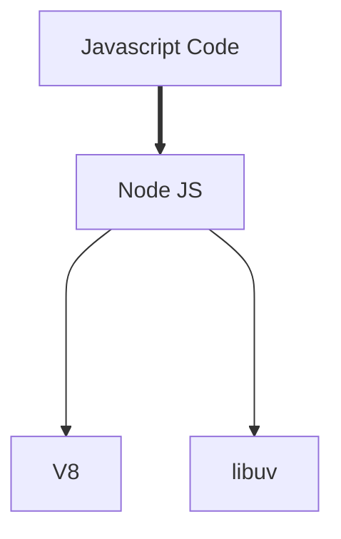
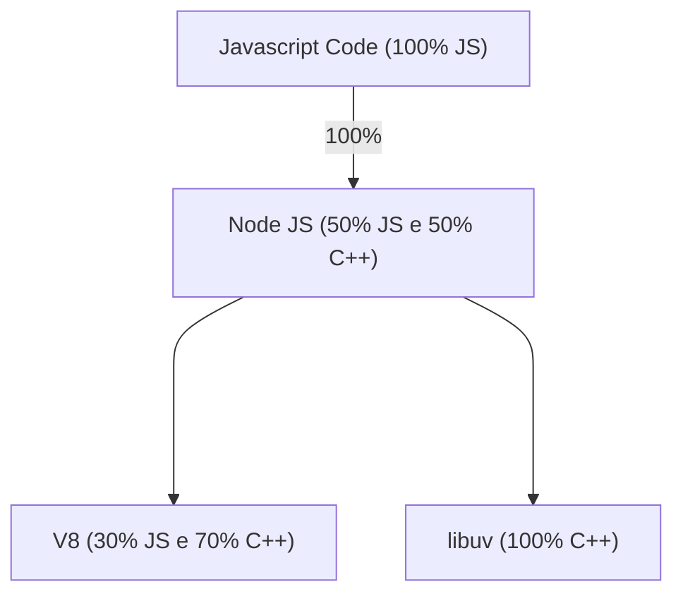

# Nodejs por trás dos panos:

Nesse arquivo é mostrado alguns dos aspectos internos do Nodejs, com esse conhecimento é possível escrever códigos com mais desempenhos.

### Javascript Code:

É o código que colocamos em arquivos Javascript e, eeventualmente, executamos.

### NodeJS:

É incovado/chamado quando executamos o NodeJS e depois indexamos .js na linha de comando.

## Dependências do Nodejs:

### V8:

É um mecanismo de JavaScript criado pelo Google, tem como objetivo executar o código fora do navegador.

### libuv:

É um projeto open source em C++ que fornecesse acesso ao Nodejs ao Sistema Operacional, redes e também lida com alguns aspectos de simultaneidade.

### Perguntas:

Qual é o propósito do Nodejs, não poderiamos apenas vincular o Javascript direto com as dependências necessárias ?

Antes de responder essa pergunta é necessário entender como funciona a distribuição do JS nesse processo:

Percebe-se que em baixo dos panos é usado bem mais C++ do que o próprio JS (JavaScript), ai entra um dos propósitos do Nodejs:

* Fornecer uma interface agradável para relacionar o JavaScript do nosso projeto com o C++ que roda em nosso computador que interpreta e executa o código em si.

## Referências:

* [Nodejs GitHub](https://github.com/nodejs/node)
* [Nodejs LearnWebsite](https://nodejs.dev/pt/learn/the-v8-javascript-engine/)

