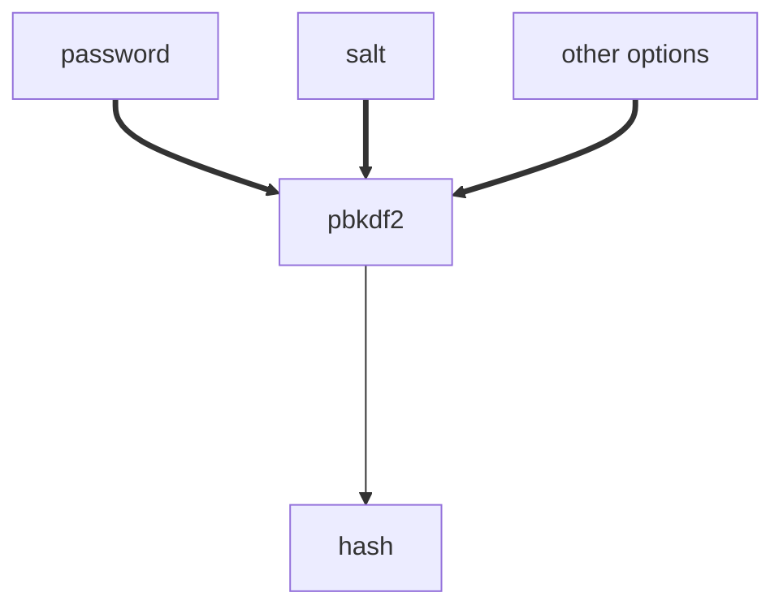

# Nodejs Modulos:

Sabemos que dentro do Nodejs temos acessos há vários módulos/libs, por exemplo:

* http;
* fs;
* cryptop;
* path;

Todos tem uma funcionaliade muito consistente e na maioria das vezes sempre representam uma funcionalidade do projeto libuv.

### Como funciona na prática ?

Onde está implementada no código do Nodejs ?

Como se comunica com o V8 e libuv ?

Iremos investigar como a função **pbkdf2** realmente funciona:

**Curiosidade**: O PBKDF2 (Password-Based Key Derivation Function 2) é uma função que permite derivar uma chave de segurança a partir de uma senha. Ele é frequentemente usado para armazenar senhas de forma segura, tornando mais difícil para os atacantes descobrir as senhas originais através de ataques de força bruta.

