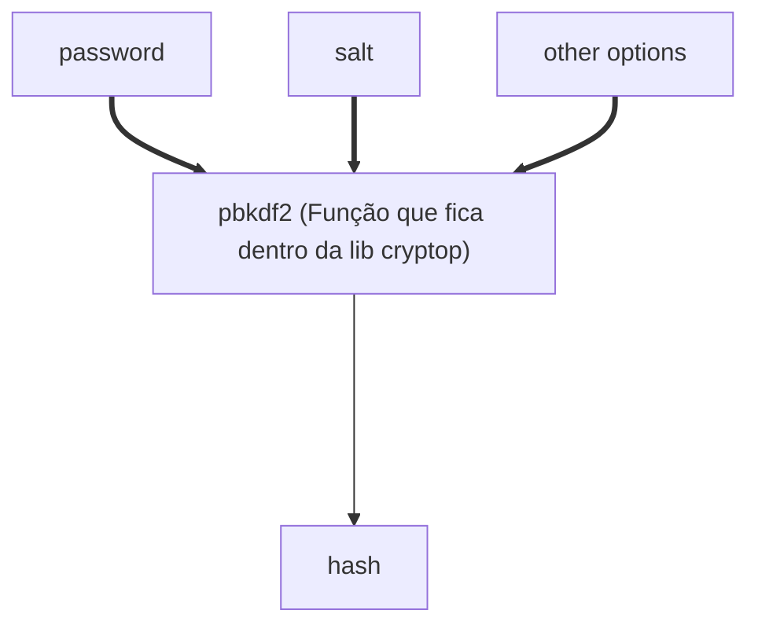
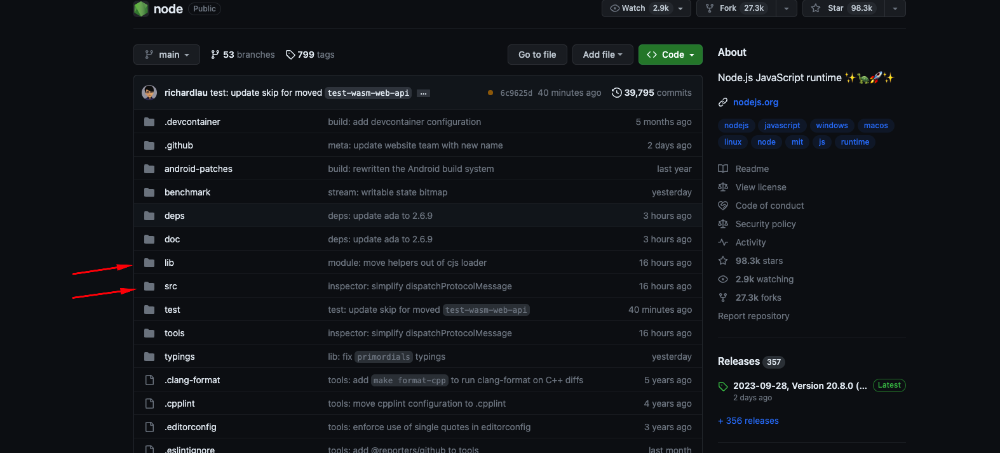
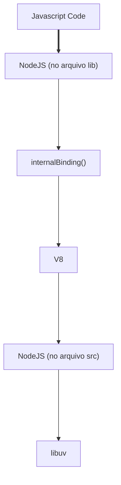

# Nodejs Modulos:

Sabemos que dentro do Nodejs temos acessos há vários módulos/libs, por exemplo:

* http;
* fs;
* cryptop;
* path;

Todos tem uma funcionaliade muito consistente e na maioria das vezes sempre representam uma funcionalidade do projeto libuv.

## Como funciona na prática ?

Onde está implementada no código do Nodejs ?

Como se comunica com o V8 e libuv ?

Iremos investigar como a função **pbkdf2** realmente funciona:

**Curiosidade**: O PBKDF2 (Password-Based Key Derivation Function 2) é uma função no qual fica dentro da biblíoteca "cryptop" que permite derivar uma chave de segurança a partir de uma senha. Ele é frequentemente usado para armazenar senhas de forma segura, tornando mais difícil para os atacantes descobrir as senhas originais através de ataques de força bruta.

Acessando o [Reposótrio do Nodejs](https://github.com/nodejs/node) é possível identificar as pastas **lib** e **src**:

### Por que dar ênfase nelas?

* A pasta lib contém todas as definições em JavaScript das funções e módulos que precisamos em nossos projetos (É o lado do Javascript).
* Na past src está a implementações das funcionalidades que contem na pasta "lib" mas em C++.

Portanto acessando o path [lib/internal/crypto/pbkdf2.js](https://github.com/nodejs/node/blob/main/lib/internal/crypto/pbkdf2.js) encontramos a definição do **pbkdf2** no lado do JavaScript.

Debugando nota-se que dentro da função [pbkdf2](https://github.com/nodejs/node/blob/main/lib/internal/crypto/pbkdf2.js#L32) a variável **job** tem a instância da classe **PBKDF2Job**, olhando as importações podemos ver que a classe [PBKDF2Job](https://github.com/nodejs/node/blob/main/lib/internal/crypto/pbkdf2.js#L10) vem da descontrução do **internalBinding('crypto')** e é dentro dele que o **hash** é calculado.

### O que é o internalBinding()?

O internalBinding() também conhecido como process.binding(), tem como responsabilidade conectar as funções em JS com as em C++.

### Mas como o "todo" funciona ?

Identificamos que o fluxo é:

