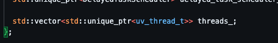

# Nodejs Modulos:

Sabemos que dentro do Nodejs temos acessos há vários módulos/libs, por exemplo:

* http;
* fs;
* cryptop;
* path;

Todos tem uma funcionaliade muito consistente e na maioria das vezes sempre representam uma funcionalidade do projeto libuv.

## Como funciona na prática ?

Iremos investigar como a função **pbkdf2** realmente funciona para entendermos como o V8 e o libuv se encaixam no nosso dia a dia:

**Curiosidade**: O PBKDF2 (Password-Based Key Derivation Function 2) é uma função no qual fica dentro da biblíoteca "cryptop" que permite derivar uma chave de segurança a partir de uma senha. Ele é frequentemente usado para armazenar senhas de forma segura, tornando mais difícil para os atacantes descobrir as senhas originais através de ataques de força bruta.

Acessando o [Reposótrio do Nodejs](https://github.com/nodejs/node) é possível identificar as pastas **lib** e **src**:

### Por que dar ênfase nelas?

* A pasta lib contém todas as definições em JavaScript das funções e módulos que precisamos em nossos projetos (É o lado do Javascript).
* Na pasta src está a implementações das funcionalidades que contem na pasta "lib" mas em C++.

Portanto acessando o path [lib/internal/crypto/pbkdf2.js](https://github.com/nodejs/node/blob/main/lib/internal/crypto/pbkdf2.js) encontramos a definição do **pbkdf2** no lado do JavaScript.

Debugando nota-se que dentro da função [pbkdf2](https://github.com/nodejs/node/blob/main/lib/internal/crypto/pbkdf2.js#L32) a variável **job** tem a instância da classe **PBKDF2Job**, olhando as importações podemos ver que a classe [PBKDF2Job](https://github.com/nodejs/node/blob/main/lib/internal/crypto/pbkdf2.js#L10) vem da descontrução do **internalBinding('crypto')** e é dentro dele que o **hash** é calculado.

### O que é o internalBinding()?

O internalBinding() também conhecido como process.binding(), tem como responsabilidade conectar as funções em JS com as em C++.

### Como o hash é feito ?

Por causa do internalBinding e do V8 (será explicado mais para frente) o nosso código em JS consegue se comunicar com a classe **PBKDF2Job** que está em C++, sabemos que essa parte fica na pasta src, portanto acessando [src/node_crypto.cc](https://github.com/nodejs/node/blob/main/src/node_crypto.cc) na [linha 51](https://github.com/nodejs/node/blob/main/src/node_crypto.cc#L51) encontramos a Classe que estamos utilizando.

Não chegarei em detalhes na parte do C++, mas resumidamente o **CRYPTO_NAMESPACE_LIST_BASE** possuí o parâmetro "V", tal parâmetro espera o nome de um macro para ser expandido para cada símbolo listado com a definição do mesmo. Quando usamos o **PBKDF2job** ele é passado como argumento para o macro **CRYPTO_NAMESPACE_LIST_BASE**, por causa disso, ela será expandida com o nome **PBKDF2job** para cada entrada na lista de símbolos definida no macro. Isso significa que cada símbolo na lista será prefixado com **PBKDF2job** quando a macro for expandida.

Com isso será possível chamar a [função/arquivo](https://github.com/nodejs/node/blob/main/src/crypto/crypto_pbkdf2.cc) que lida com toda a lógica para gerar o hash.

### Mas como o "todo" funciona ?

Identificamos que o fluxo é:

**Como o V8 e libuv entram no processo?**

* V8: Nos arquivos podemos identificar diversas vezes o v8 sendo usado: 

Assim, o propósito do projeto V8 dentro de todo esse código em C++ é essencialmente agir como intermediário e permitir que os valores definidos dentro do JavaScript/NodeJS sejam traduzidos para sua equivalência em C++.

* libuv: Ela é um pouco mais difícil de ser encontrada, mas em certas parte do código em C++ há:

Sua tarefa é lidar com tarefas de I/O (Input/Output - Entrada/Saída) assíncronas e agendamento de eventos em sistemas operacionais. Ela desempenha um papel fundamental na arquitetura de I/O não bloqueante do Node.js e é responsável por várias funcionalidades essenciais, como:

* Gerenciamento de I/O Assíncronas;
* Loop de Eventos;
* Cross-Platform;
* Manipulação de Threads e Eventos;
