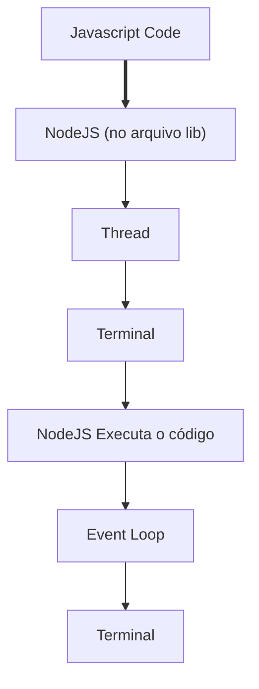
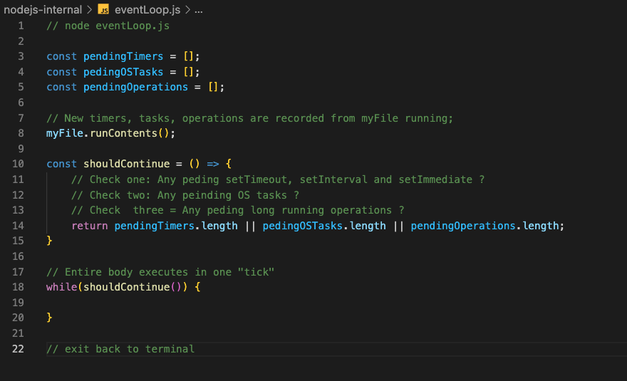

# Event Loop

Quando executamos um arquivo .js com o NodeJS ele cria uma Thread e dentro dela ocorre o Event Loop.

O Event Loop orquestra as ordem das coisas que são executadas em nossa Thread.

O Event Loop, como o nome já diz ele faz um loop executando o nosso código cada iterata é conhecido como **tick**,
a cada **tick** finalizado o Node verifica se o Event Loop deve ou não prosseguir.

### O que o NodeJS verifica ?

NodeJS faz três verificações para decidir se o loop deve continuar:

* Verifica se tem alguma função pendente que ainda tenha que ser executada através de intervalos de tempo (setTimeout, setInterval e setImmediate).

* Verifica se tem alguma pendência com OS tasks (Exemplo: server listening alguma porta/HTTP request).

* Verifica se tem alguma operação longa que ainda está rodando (Exemplo: fs module).

Caso uma delas esteja pendente o Event Loop irá fazer mais **ticks**.

Código ilustrativo de como Event Loop é desenvolvido:

