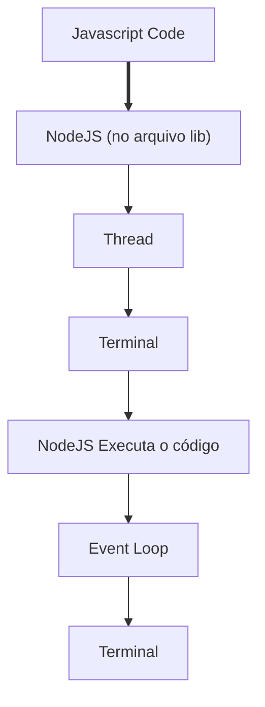

# Event Loop

Quando executamos um arquivo .js com o NodeJS ele cria uma Thread e dentro dela ocorre o Event Loop.

O Event Loop orquestra as ordem das coisas que são executadas em nossa Thread.

O Event Loop, como o nome já diz ele faz um loop executando o nosso código cada iterata é conhecido como **tick**,
a cada **tick** finalizado o Node verifica se o Event Loop deve ou não prosseguir.

